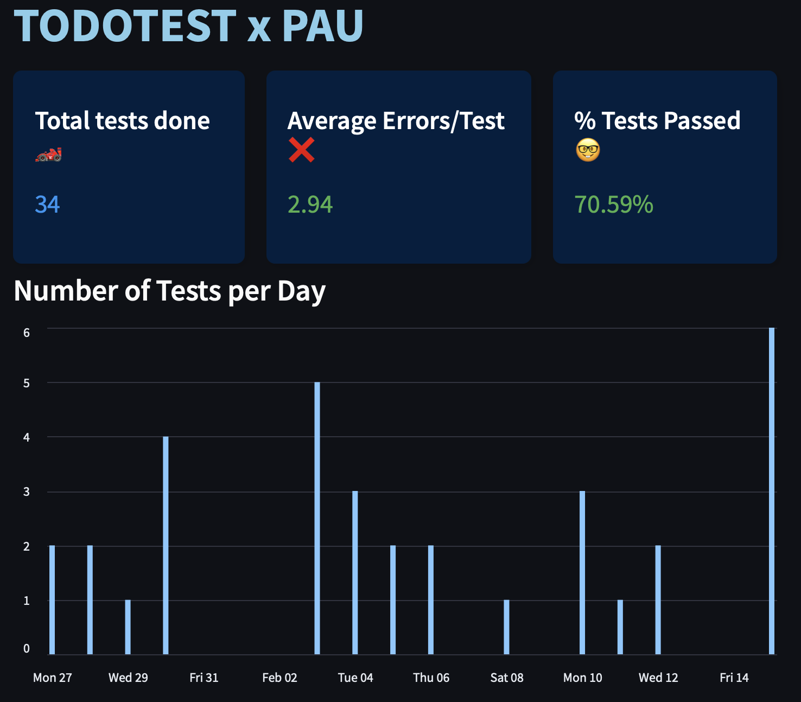

# Web Scraper with Streamlit

## Project Overview

This project is a **web scraper** developed in **Python** to extract data from a website. Once the data is collected, a **Streamlit** frontend was built to present the results in an interactive and user-friendly manner.

## Features

- **Web Scraping**: Extract data from a specified website using Python.
- **Data Processing**: Clean and format the extracted data for further analysis.
- **Streamlit Dashboard**: Display the processed data with an interactive interface, including charts and tables.

## Technologies Used

- **Python**: Programming language used for building the scraper and backend logic.
- **Streamlit**: Framework used to build the frontend and display data visually.
- **Selenium**: Web automation tool to handle dynamic web pages and JavaScript rendering.
- **Pandas**: Data manipulation library used for processing and analyzing the scraped data.

## Output ##
The dashboard provides some insights of the tests done by the user.

